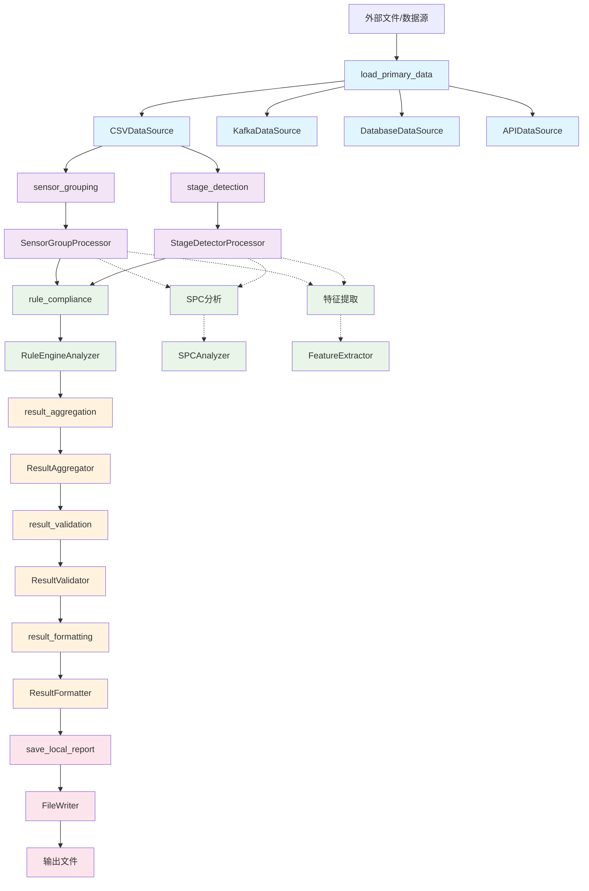

# 工作流类关系图

## 概述

本文档展示了OPLib工作流系统的完整架构，包括五层架构设计、类关系图、数据流图。

## 五层架构类关系图

```mermaid
classDiagram
    %% 类型定义层
    class TypedDictTypes {
        <<types>>
        +DataSourceOutput
        +SensorGroupingOutput
        +StageDetectionOutput
        +DataAnalysisOutput
        +ResultAggregationOutput
        +ResultValidationOutput
        +ResultFormattingOutput
        +Metadata
        +GroupingInfo
        +WorkflowResult
    }

    %% 基础接口层
    class BaseDataSource {
        <<interface>>
        +read() DataSourceOutput
        +validate() bool
        +get_algorithm() str {default implementation}
    }
    
    class BaseDataProcessor {
        <<interface>>
        +process(data) Union[SensorGroupingOutput, StageDetectionOutput]
        +get_algorithm() str {default implementation}
    }
    
    class BaseDataAnalyzer {
        <<interface>>
        +analyze(data) DataAnalysisOutput
        +get_algorithm() str {default implementation}
    }
    
    class BaseResultMerger {
        <<interface>>
        +merge(results) Union[ResultAggregationOutput, ResultValidationOutput, ResultFormattingOutput]
        +get_algorithm() str {default implementation}
    }
    
    class BaseResultBroker {
        <<interface>>
        +broker(result) str
        +get_broker_type() str {default implementation}
    }

    %% 数据源层 (Layer 1)
    class CSVDataSource {
        -path: str
        -format: str
        -timestamp_column: str
        -algorithm: str
        +read() DataSourceOutput
        +validate() bool
        +get_algorithm() str {inherited}
    }
    
    class KafkaDataSource {
        -topic: str
        -brokers: list
        -group_id: str
        -algorithm: str
        +read() DataSourceOutput
        +validate() bool
        +get_algorithm() str {inherited}
    }
    
    class DatabaseDataSource {
        -connection_string: str
        -query: str
        -algorithm: str
        +read() DataSourceOutput
        +validate() bool
        +get_algorithm() str {inherited}
    }
    
    class APIDataSource {
        -url: str
        -method: str
        -headers: Dict[str, str]
        -algorithm: str
        +read() DataSourceOutput
        +validate() bool
        +get_algorithm() str {inherited}
    }

    %% 数据处理层 (Layer 2)
    class SensorGroupProcessor {
        -algorithm: str
        -calculation_config: str
        -process_id: str
        +process(data) SensorGroupingOutput
        +_perform_grouping() GroupingInfo
        +get_algorithm() str {inherited}
    }
    
    class StageDetectorProcessor {
        -algorithm: str
        -stage_config: str
        -process_id: str
        +process(data) StageDetectionOutput
        +_detect_stages() StageInfo
        +get_algorithm() str {inherited}
    }
    
    class DataPreprocessor {
        -algorithm: str
        -method: str
        -threshold: float
        +process(data) Union[SensorGroupingOutput, StageDetectionOutput]
        +get_algorithm() str {inherited}
    }
    
    class DataCleaner {
        -algorithm: str
        -method: str
        +process(data) Union[SensorGroupingOutput, StageDetectionOutput]
        +_clean_data() Dict[str, Any]
        +_linear_interpolation() np.ndarray
        +get_algorithm() str {inherited}
    }

    %% 数据分析层 (Layer 3)
    class RuleEngineAnalyzer {
        -algorithm: str
        -rule_config: str
        -spec_config: str
        -rules_index: Dict[str, Any]
        +analyze(data) DataAnalysisOutput
        +_check_rules() Dict[str, RuleResult]
        +_evaluate_rule() Dict[str, Any]
        +get_algorithm() str {inherited}
    }
    
    class SPCAnalyzer {
        -algorithm: str
        -chart_type: str
        -control_limits: str
        +analyze(data) DataAnalysisOutput
        +get_algorithm() str {inherited}
    }
    
    class FeatureExtractor {
        -algorithm: str
        -features: List[str]
        +analyze(data) DataAnalysisOutput
        +get_algorithm() str {inherited}
    }
    
    class CNNPredictor {
        -algorithm: str
        -model_path: str
        -input_shape: list
        +analyze(data) DataAnalysisOutput
        +get_algorithm() str {inherited}
    }
    
    class AnomalyDetector {
        -algorithm: str
        -contamination: float
        +analyze(data) DataAnalysisOutput
        +_detect_anomalies() Dict[str, Any]
        +_isolation_forest_detection() Dict[str, Any]
        +_statistical_anomaly_detection() Dict[str, Any]
        +get_algorithm() str {inherited}
    }

    %% 结果合并层 (Layer 4)
    class ResultAggregator {
        -algorithm: str
        -weights: Dict[str, float]
        +merge(results) ResultAggregationOutput
        +_weighted_average_merge() Dict[str, Any]
        +_majority_vote_merge() Dict[str, Any]
        +_consensus_merge() Dict[str, Any]
        +_simple_merge() Dict[str, Any]
        +get_algorithm() str {inherited}
    }
    
    class ResultValidator {
        -algorithm: str
        -validation_rules: str
        +merge(results) ResultValidationOutput
        +_consistency_check() ValidationResult
        +_range_validation() ValidationResult
        +_type_validation() ValidationResult
        +_basic_validation() ValidationResult
        +get_algorithm() str {inherited}
    }
    
    class ResultFormatter {
        -algorithm: str
        -output_format: str
        -include_metadata: bool
        +merge(results) ResultFormattingOutput
        +_standard_format() Dict[str, Any]
        +_summary_format() Dict[str, Any]
        +_detailed_format() Dict[str, Any]
        +_basic_format() Dict[str, Any]
        +get_algorithm() str {inherited}
    }

    %% 结果输出层 (Layer 5)
    class FileWriter {
        -algorithm: str
        -path: str
        -format: str
        -base_dir: str
        +broker(result) str
        +_write_json() void
        +_write_yaml() void
        +_write_text() void
        +get_broker_type() str {inherited}
    }
    
    class WebhookWriter {
        -algorithm: str
        -url: str
        -method: str
        -headers: Dict[str, str]
        +broker(result) str
        +get_broker_type() str {inherited}
    }
    
    class KafkaWriter {
        -algorithm: str
        -topic: str
        -brokers: list
        +broker(result) str
        +get_broker_type() str {inherited}
    }
    
    class DatabaseWriter {
        -algorithm: str
        -connection_string: str
        -table: str
        +broker(result) str
        +get_broker_type() str {inherited}
    }

    %% 工作流管理
    class WorkflowBuilder {
        -config_manager: ConfigManager
        -rules_index: Dict[str, Any]
        +build(workflow_config) Callable
        +_execute_data_source_task() DataSourceOutput
        +_execute_data_processing_task() Union[SensorGroupingOutput, StageDetectionOutput]
        +_execute_data_analysis_task() DataAnalysisOutput
        +_execute_result_merging_task() Union[ResultAggregationOutput, ResultValidationOutput, ResultFormattingOutput]
        +_execute_result_output_task() str
    }
    
    class WorkflowExecutor {
        -config: Dict[str, Any]
        +execute(flow_func) Union[str, Dict[str, Any]]
        +execute_async(flow_func) Union[str, Dict[str, Any]]
        +execute_with_monitoring() Dict[str, Any]
    }

    %% 工厂类
    class DataSourceFactory {
        <<factory>>
        +create_source(config) BaseDataSource
        +register_source(type, class)
    }
    
    class DataProcessingFactory {
        <<factory>>
        +create_processor(config) BaseDataProcessor
        +register_processor(type, class)
    }
    
    class DataAnalysisFactory {
        <<factory>>
        +create_analyzer(config) BaseDataAnalyzer
        +register_analyzer(type, class)
    }
    
    class ResultMergingFactory {
        <<factory>>
        +create_merger(config) BaseResultMerger
        +register_merger(type, class)
    }
    
    class ResultBrokerFactory {
        <<factory>>
        +create_broker(config) BaseResultBroker
        +register_broker(type, class)
    }

    %% 继承关系
    BaseDataSource <|-- CSVDataSource
    BaseDataSource <|-- KafkaDataSource
    BaseDataSource <|-- DatabaseDataSource
    BaseDataSource <|-- APIDataSource
    
    BaseDataProcessor <|-- SensorGroupProcessor
    BaseDataProcessor <|-- StageDetectorProcessor
    BaseDataProcessor <|-- DataPreprocessor
    BaseDataProcessor <|-- DataCleaner
    
    BaseDataAnalyzer <|-- RuleEngineAnalyzer
    BaseDataAnalyzer <|-- SPCAnalyzer
    BaseDataAnalyzer <|-- FeatureExtractor
    BaseDataAnalyzer <|-- CNNPredictor
    BaseDataAnalyzer <|-- AnomalyDetector
    
    BaseResultMerger <|-- ResultAggregator
    BaseResultMerger <|-- ResultValidator
    BaseResultMerger <|-- ResultFormatter
    
    BaseResultBroker <|-- FileWriter
    BaseResultBroker <|-- WebhookWriter
    BaseResultBroker <|-- KafkaWriter
    BaseResultBroker <|-- DatabaseWriter

    %% 类型关系
    TypedDictTypes ..> BaseDataSource : defines
    TypedDictTypes ..> BaseDataProcessor : defines
    TypedDictTypes ..> BaseDataAnalyzer : defines
    TypedDictTypes ..> BaseResultMerger : defines
    TypedDictTypes ..> BaseResultBroker : defines
    TypedDictTypes ..> WorkflowBuilder : defines
    TypedDictTypes ..> WorkflowExecutor : defines

    %% 工厂关系
    DataSourceFactory ..> BaseDataSource : creates
    DataProcessingFactory ..> BaseDataProcessor : creates
    DataAnalysisFactory ..> BaseDataAnalyzer : creates
    ResultMergingFactory ..> BaseResultMerger : creates
    ResultBrokerFactory ..> BaseResultBroker : creates

    %% 工作流关系
    WorkflowBuilder ..> DataSourceFactory : uses
    WorkflowBuilder ..> DataProcessingFactory : uses
    WorkflowBuilder ..> DataAnalysisFactory : uses
    WorkflowBuilder ..> ResultMergingFactory : uses
    WorkflowBuilder ..> ResultBrokerFactory : uses
    WorkflowExecutor ..> WorkflowBuilder : executes
```

## 数据流图




## 任务输入输出总结表

| 层级 | 任务ID | 输入类型 | 输出类型 | 说明 |
|------|--------|----------|----------|------|
| **数据源层** | load_primary_data | `Dict[str, Any]` | `DataSourceOutput` | 外部文件路径参数 |
| **数据处理层** | sensor_grouping | `DataSourceOutput` | `SensorGroupingOutput` | 传感器分组处理 |
| | stage_detection | `DataSourceOutput` | `StageDetectionOutput` | 阶段检测处理 (实际只使用第一个依赖) |
| **数据分析层** | rule_compliance | `StageDetectionOutput` | `DataAnalysisOutput` | 规则合规检查 (实际只使用第一个依赖) |
| | (可扩展) | `Union[SensorGroupingOutput, StageDetectionOutput]` | `DataAnalysisOutput` | SPC分析、特征提取等 |
| **结果合并层** | result_aggregation | `List[DataAnalysisOutput]` | `ResultAggregationOutput` | 结果聚合 |
| | result_validation | `List[ResultAggregationOutput]` | `ResultValidationOutput` | 结果验证 |
| | result_formatting | `List[ResultValidationOutput]` | `ResultFormattingOutput` | 结果格式化 |
| **结果输出层** | save_local_report | `ResultFormattingOutput` | `str` | 文件路径字符串 |


## TypedDict类型定义

### 核心数据类型

```python
# 数据源层输出
class DataSourceOutput(TypedDict):
    data: Dict[str, List[Any]]  # 传感器数据字典
    metadata: Metadata          # 元数据

# 传感器分组输出
class SensorGroupingOutput(TypedDict):
    grouping_info: GroupingInfo
    algorithm: str
    process_id: str
    input_metadata: Metadata

# 元数据格式
class Metadata(TypedDict):
    source_type: str
    format: str
    timestamp_column: str
    row_count: int
    column_count: int
    columns: List[str]
    file_path: Optional[str]
    created_at: Optional[str]
    updated_at: Optional[str]

# 分组信息
class GroupingInfo(TypedDict):
    total_groups: int
    group_names: List[str]
    group_mappings: Dict[str, List[str]]
    algorithm_used: str

# 工作流结果类型
WorkflowResult = Union[DataSourceOutput, SensorGroupingOutput, 
                      StageDetectionOutput, DataAnalysisOutput, 
                      ResultAggregationOutput, ResultValidationOutput, 
                      ResultFormattingOutput, str]

# 输出结果格式
OutputResult = Union[str, DataSourceOutput, SensorGroupingOutput, 
                    StageDetectionOutput, DataAnalysisOutput, 
                    ResultAggregationOutput, ResultValidationOutput, 
                    ResultFormattingOutput]
```


### 核心数据类型

```python
# 数据源层输出
class DataSourceOutput(TypedDict):
    data: Dict[str, List[Any]]  # 传感器数据字典
    metadata: Metadata          # 元数据

# 传感器分组输出
class SensorGroupingOutput(TypedDict):
    grouping_info: GroupingInfo
    algorithm: str
    process_id: str
    input_metadata: Metadata

# 元数据格式
class Metadata(TypedDict):
    source_type: str
    format: str
    timestamp_column: str
    row_count: int
    column_count: int
    columns: List[str]
    file_path: Optional[str]
    created_at: Optional[str]
    updated_at: Optional[str]

# 分组信息
class GroupingInfo(TypedDict):
    total_groups: int
    group_names: List[str]
    group_mappings: Dict[str, List[str]]
    algorithm_used: str

# 工作流结果类型
WorkflowResult = Union[DataSourceOutput, SensorGroupingOutput, 
                      StageDetectionOutput, DataAnalysisOutput, 
                      ResultAggregationOutput, ResultValidationOutput, 
                      ResultFormattingOutput, str]

# 输出结果格式
OutputResult = Union[str, DataSourceOutput, SensorGroupingOutput, 
                    StageDetectionOutput, DataAnalysisOutput, 
                    ResultAggregationOutput, ResultValidationOutput, 
                    ResultFormattingOutput]
```

## 并行执行说明
- **当前实现**: 串行执行，通过拓扑排序确定顺序
- **架构支持**: data_analysis层支持多个并行task，共享相同输入
- **扩展性**: 可以轻松添加更多分析器，它们可以并行处理相同的数据
