# OPLib 流式数据架构分析与改造建议

## 执行摘要

基于对当前代码库的全面分析，本文档从系统架构师角度评估了将OPLib从离线CSV数据处理迁移到在线IoT数据流处理所需的架构改造。核心结论是：**不需要Lambda或Kappa架构的完整重构**，当前基于分层的架构已具备良好的扩展性基础，仅需强化现有架构的流式能力。

---

## 1. 当前架构评估

### 1.1 现有架构优势

**五层分层架构**
```
API层 → 工作流管理层 → 核心业务层 → 工厂层 → 配置管理层
```

**核心特点：**
- ✅ **已实现接口抽象**：`BaseDataSource` 已抽象数据源接口
- ✅ **工厂模式**：组件通过工厂动态创建，支持运行时替换
- ✅ **配置驱动**：业务流程完全通过YAML配置，无需改代码
- ✅ **类型安全**：使用TypedDict提供强类型约束
- ✅ **数据流管理**：已有 `DataFlowManager` 和 `DataFlowMonitor`

### 1.2 现有流式支持基础设施

通过代码分析发现，系统已经具备部分流式处理的基石：

```python
# 1. 接口层已支持流式数据源
class BaseDataSource:
    @abstractmethod
    def read(self, **kwargs) -> DataSourceOutput: pass

# 2. Kafka支持已预留（未实现）
class KafkaDataSource(BaseDataSource):
    def read(self, **kwargs) -> DataSourceOutput:
        raise WorkflowError("Kafka数据源尚未实现")

# 3. 工作流输入模型已支持在线模式标识
class WorkflowInputs(BaseModel):
    file_path: Optional[str] = None
    online_data: Optional[bool] = None  # ⚠️ 已定义但未使用
```

### 1.3 当前数据流程（批处理模式）

```mermaid
graph LR
    A[CSV文件] --> B[read一次性加载]
    B --> C[DataFrame转换]
    C --> D[批处理分析]
    D --> E[完整结果输出]
```



**特征：**
- 一次性读取完整数据集
- 全部数据加载到内存
- 所有处理环节针对完整数据集

---

## 2. Lambda架构 vs Kappa架构对比

### 2.1 Lambda架构

**核心思想：** 批处理层（历史准确性）+ 速度层（实时性）+ 服务层（统一查询）

```
批处理层（Batch Layer）
    ↓
服务层（Serving Layer） ← 速度层（Speed Layer）
```

**适用场景：**
- 需要离线批处理与在线流处理同时满足
- 历史数据准确性要求高
- 需要统一的历史+实时查询视图

**复杂性：**
- ⚠️ 两套代码路径
- ⚠️ 两个数据管道
- ⚠️ 需要合并逻辑（"Lambda = Batch ⊔ Speed"）

### 2.2 Kappa架构

**核心思想：** 单一流处理管道，历史数据通过回放实现

```
流式数据源 → 流处理引擎 → 结果存储
                ↓
         (历史回放模式)
```

**适用场景：**
- 流处理能力足够强
- 历史查询需求不频繁
- 架构简洁性优先

**复杂性：**
- ✅ 单一代码路径
- ✅ 统一数据模型
- ⚠️ 历史数据查询性能有限

---

## 3. 架构建议：改进型单管道架构（推荐）🌟

### 3.1 核心理念

**不采用Lambda/Kappa，而是增强现有五层架构的流式能力**

**原因分析：**

1. **业务场景特点**
   - 热压罐固化工艺分析场景中，数据是**有限的时序数据集**
   - 一个固化周期（几小时到十几小时）的数据量相对可控
   - 不是无限流，而是**有始有终的周期数据流**

2. **现有架构优势**
   - 五层架构天然支持数据源互换
   - 工作流编排器已经实现了任务间的依赖管理
   - 配置驱动的设计使得添加新数据源无需改核心代码

3. **改造成本评估**
   - Lambda架构：需要引入批处理+速度层双管道，复杂度高
   - Kappa架构：需要引入流处理引擎，但现有业务逻辑主要面向批处理
   - **增强现有架构**：只需实现Kafka数据源和加装时间窗口缓冲

### 3.2 改进方案详细设计

#### 方案A：微批次缓冲策略（推荐）

**设计思路：**
```
IoT数据源 → 时间窗口缓冲器 → 微批次 → 现有处理流水线
```

**实现策略：**

```yaml
# config/workflow_config.yaml - 增强配置示例
workflows:
  curing_analysis_online:
    name: "在线固化分析工作流"
    parameters:
      online_data: true
      buffer_window_minutes: 5  # 5分钟微批次
    
    workflow:
      - layer: "data_source"
        tasks:
          - id: "load_online_data"
            implementation: "kafka"
            algorithm: "micro_batch_reader"
            inputs:
              topic: "sensor_data"
              window_minutes: 5
              max_records: 1000
            depends_on: []
      
      # 后续处理层保持不变！
      - layer: "data_processing"
        tasks:
          - id: "sensor_grouping"
            implementation: "data_grouper"
            algorithm: "sensor_grouper"
            depends_on: ["load_online_data"]
```

**优势：**
- ✅ 最大化复用现有处理逻辑
- ✅ 最小化架构改动
- ✅ 通过Kafka消费组支持水平扩展
- ✅ 保持结果一致性（基于时间窗口）

#### 方案B：滑动窗口处理（高级）

**适用场景：** 需要实时趋势分析

```python
class SlidingWindowProcessor(BaseDataProcessor):
    """滑动窗口处理器"""
    
    def __init__(self, window_size: int = 100, slide_size: int = 10):
        self.window_size = window_size  # 窗口大小
        self.slide_size = slide_size    # 滑动步长
        
    def process(self, data: DataSourceOutput) -> SensorGroupingOutput:
        # 使用时间窗口内的数据
        windowed_data = self._extract_window(data)
        return super().process(windowed_data)
```

#### 方案C：双模式支持（最灵活）

**设计：** 根据 `online_data` 标志自动选择处理模式

```python
# src/data/sources/smart_source.py
class SmartDataSource(BaseDataSource):
    """智能数据源 - 根据标志选择批处理或流处理"""
    
    def __init__(self, **kwargs):
        self.online_mode = kwargs.get("online_data", False)
        if self.online_mode:
            self.source = KafkaDataSource(**kwargs)
        else:
            self.source = CSVDataSource(**kwargs)
    
    def read(self, **kwargs) -> DataSourceOutput:
        return self.source.read(**kwargs)
```

---

## 4. 实施路线图

### 阶段1：实现流式数据源适配器（1-2周）

**目标：** 实现Kafka/IoT数据源，对接现有流水线

**任务清单：**
```python
# 1. 完善KafkaDataSource实现
class KafkaDataSource(BaseDataSource):
    def __init__(self, topic: str, window_minutes: int = 5, **kwargs):
        self.topic = topic
        self.window_minutes = window_minutes
        # Kafka消费者初始化
        self.consumer = KafkaConsumer(topic, **kwargs)
    
    def read(self, **kwargs) -> DataSourceOutput:
        # 读取时间窗口内的数据
        records = []
        end_time = time.time() + (self.window_minutes * 60)
        
        for msg in self.consumer:
            if time.time() > end_time:
                break
            records.append(msg)
        
        # 转换为与CSV相同的DataSourceOutput格式
        return self._format_as_data_source_output(records)
```

**验证标准：**
- Kafka数据源能输出标准`DataSourceOutput`格式
- 工作流配置可指定`implementation: "kafka"`
- 现有处理层无需改动即可处理

### 阶段2：添加流式处理能力（2-3周）

**目标：** 为分析层增加实时处理支持

**关键模块：**

```python
# src/analysis/streaming/
class StreamingAnalysisBase:
    """流式分析基类"""
    
    def analyze_incremental(self, 
                           new_data: DataFrame,
                           previous_state: Dict) -> AnalysisResult:
        """增量分析 - 使用滑动窗口状态"""
        pass

# 具体实现
class StreamingRuleEngineAnalyzer(RuleEngineAnalyzer, StreamingAnalysisBase):
    """流式规则引擎 - 支持增量规则检查"""
    pass
```

### 阶段3：优化与监控（1-2周）

**任务：**
- 性能优化（窗口聚合优化）
- 流式监控（延迟、吞吐量）
- 容错机制（数据补发、一致性）

---

## 5. 技术选型建议

### 5.1 流处理引擎选择

| 方案 | 优点 | 缺点 | 推荐度 |
|------|------|------|--------|
| **Kafka Streaming** | 与现有Kafka集成好，低延迟 | 功能相对简单 | ⭐⭐⭐⭐⭐ |
| Apache Flink | 功能强大，状态管理完善 | 复杂度高，资源消耗大 | ⭐⭐⭐ |
| Apache Spark Streaming | 成熟稳定，生态丰富 | 延迟相对较高 | ⭐⭐⭐⭐ |
| **自定义微批次** | 简单可控，易维护 | 功能有限 | ⭐⭐⭐⭐⭐ |

**推荐：Kafka Streams + 微批次缓冲**  
- 与现有Kafka基础设施一致
- 延迟可控制在秒级
- 复杂度适中

### 5.2 状态管理

**选项1：内存状态（简单）**
```python
class InMemoryStateStore:
    """内存状态存储 - 适合短期状态"""
    def __init__(self, ttl_seconds: int = 3600):
        self.store = {}
        self.ttl = ttl_seconds
```

**选项2：Redis状态（推荐）**
```python
class RedisStateStore:
    """Redis状态存储 - 支持分布式和持久化"""
    def __init__(self, redis_client):
        self.client = redis_client
```

**选项3：Kafka Streams状态存储**
```python
# 使用Kafka Streams的内置状态存储
from kafka.streams import StreamsBuilder
builder = StreamsBuilder()
# 自动管理状态
```

---

## 6. 架构演进路径

### 6.1 短期（3个月内）

```
当前：批处理CSV
  ↓
增强：批处理CSV + 流处理Kafka（双模式）
  ↓
统一：流处理为主（Kafka为主要数据源）
```

### 6.2 中期（6-12个月）

**如果需要历史分析需求增多：**

```
流处理 + 历史存储
  ↓
Lambda架构（引入HDFS/对象存储作为批处理层）
```

### 6.3 长期（12个月以上）

**如果数据量达到大数据规模：**

```
考虑引入Flink/Spark等流处理引擎
  ↓
完整的Kappa或Lambda架构
```

---

## 7. 关键设计决策

### 7.1 数据一致性保证

**问题：** 流处理如何保证结果与批处理一致？

**方案：**
1. **使用相同处理算法**：流式数据通过时间窗口聚合后，调用完全相同的批处理逻辑
2. **状态累积**：保持一个累积状态，确保每个窗口结束时的结果与批处理等价

```python
# 伪代码示例
def process_window(window_data):
    # 使用与批处理相同的处理逻辑
    result = sensor_grouping.process(window_data)
    result = stage_detection.process(result)
    result = rule_engine.analyze(result)
    return result
```

### 7.2 容错机制

**关键点：**
- 消息确认：确保Kafka消息消费的at-least-once语义
- 状态恢复：定期保存处理状态，支持重启后恢复
- 数据补发：支持从某个时间点重新消费

### 7.3 性能优化

**瓶颈分析：**
1. **数据源**：Kafka消费速度（可通过增加分区解决）
2. **处理阶段**：规则引擎计算复杂度（可并行化）
3. **结果输出**：文件写入或数据库写入（异步化）

**优化策略：**
```python
# 1. 并行消费
consumer_config = {
    'group_id': 'oplib_workers',
    'partition_assignment_strategy': 'round_robin'
}

# 2. 批量写入
async def batch_write_results(results: List[Dict]):
    await asyncio.gather(*[write_result(r) for r in results])
```

---

## 8. 与Lambda/Kappa架构的对比

### 8.1 为什么不选择Lambda架构

❌ **不推荐原因：**
1. **业务复杂度**：需要维护批处理层和速度层两套代码
2. **数据同步**：需要处理历史数据与实时数据的合并逻辑
3. **资源消耗**：两套计算资源，成本高
4. **对于OPLib场景**：一个固化周期的数据量不大，不需要引入Hadoop生态

### 8.2 为什么不完全采用Kappa架构

❌ **不推荐原因：**
1. **现有代码投资**：已有大量针对批处理的优化代码
2. **历史查询需求**：固化工艺分析经常需要查看历史完整结果
3. **实现复杂度**：Kappa需要完整重写数据处理逻辑

### 8.3 为什么推荐增强型架构

✅ **推荐原因：**
1. **最大化投资回报**：复用80%+现有代码
2. **渐进式演进**：可以逐步迁移，降低风险
3. **配置灵活**：通过YAML配置切换批处理/流处理模式
4. **运维简单**：单一管道，无需复杂的协调机制

---

## 9. 实施风险评估

### 9.1 技术风险

| 风险项 | 影响 | 概率 | 缓解措施 |
|--------|------|------|----------|
| Kafka性能瓶颈 | 高 | 中 | 增加分区，监控消费延迟 |
| 状态管理复杂 | 中 | 中 | 使用Redis等成熟方案 |
| 数据一致性问题 | 高 | 低 | 引入幂等性检查和状态验证 |
| 内存溢出 | 中 | 低 | 流式处理+内存限制 |

### 9.2 业务风险

| 风险项 | 影响 | 概率 | 缓解措施 |
|--------|------|------|----------|
| 实时性不达标 | 中 | 低 | 性能测试和优化 |
| 历史数据查询困难 | 中 | 低 | 保留历史结果存储 |
| 用户体验下降 | 低 | 低 | 保持双模式支持 |

---

## 10. 总结与建议

### 10.1 核心结论

**无需Lambda或Kappa架构的完整重构**。当前五层架构已经具备良好的可扩展性，只需要：

1. ✅ **实现Kafka数据源适配器** - 将流式数据适配为现有接口
2. ✅ **添加时间窗口缓冲** - 将流式数据转换为微批次
3. ✅ **保持现有处理逻辑** - 最大化代码复用

### 10.2 实施优先级

**P0（必须）：**
- 实现Kafka数据源
- 添加流式配置支持

**P1（重要）：**
- 性能优化
- 监控仪表板

**P2（可选）：**
- 流式状态管理优化
- 高级流式分析算法

### 10.3 关键成功因素

1. **保持接口不变** - 确保数据源层的`DataSourceOutput`接口统一
2. **配置驱动** - 通过YAML配置实现批处理/流处理切换
3. **渐进式迁移** - 先支持双模式，再逐步优化

---

## 附录A：参考实现示例

### A.1 Kafka数据源完整实现

```python
"""Kafka数据源实现 - 流式数据适配器"""

from kafka import KafkaConsumer
from typing import Any, Dict, List
import pandas as pd
from datetime import datetime

from ...core.interfaces import BaseDataSource
from ...core.types import DataSourceOutput, Metadata

class KafkaDataSource(BaseDataSource):
    """Kafka数据源 - 实现流式数据到批处理的适配"""
    
    def __init__(self, topic: str, brokers: List[str], 
                 window_minutes: int = 5, **kwargs):
        super().__init__(**kwargs)
        self.topic = topic
        self.brokers = brokers
        self.window_minutes = window_minutes
        
        # 初始化Kafka消费者
        self.consumer = KafkaConsumer(
            self.topic,
            bootstrap_servers=self.brokers,
            **kwargs
        )
        
        self.algorithm = "kafka_windowed_reader"
    
    def read(self, **kwargs) -> DataSourceOutput:
        """读取时间窗口内的流式数据"""
        
        # 1. 消费时间窗口内的消息
        messages = []
        end_time = datetime.now().timestamp() + (self.window_minutes * 60)
        
        for msg in self.consumer:
            if datetime.now().timestamp() > end_time:
                break
                
            # 解析消息
            message_data = self._parse_message(msg)
            messages.append(message_data)
        
        # 2. 转换为DataFrame
        df = pd.DataFrame(messages)
        
        # 3. 转换为标准格式
        data = df.to_dict('list')
        
        # 4. 生成元数据
        metadata: Metadata = {
            "source_type": "kafka_stream",
            "format": "sensor_data",
            "timestamp_column": "timestamp",
            "row_count": len(df),
            "column_count": len(df.columns),
            "columns": list(df.columns),
            "file_path": None,
            "created_at": None,
            "updated_at": None
        }
        
        return DataSourceOutput(
            data=data,
            metadata=metadata
        )
    
    def _parse_message(self, msg) -> Dict[str, Any]:
        """解析Kafka消息"""
        # 根据实际消息格式实现
        import json
        return json.loads(msg.value)
    
    def validate(self) -> bool:
        """验证Kafka数据源"""
        try:
            # 测试连接
            topics = self.consumer.topics()
            return self.topic in topics
        except:
            return False
```

### A.2 流式分析器基类

```python
"""流式分析器基类 - 支持增量处理"""

from typing import Dict, Any, Optional
from abc import ABC, abstractmethod

class StreamingAnalysisBase(ABC):
    """流式分析基类 - 管理状态和增量更新"""
    
    def __init__(self, state_store: Optional[Any] = None):
        self.state_store = state_store  # 状态存储
        self.window_state: Dict[str, Any] = {}  # 窗口状态
    
    @abstractmethod
    def analyze_incremental(self, 
                           new_data: Any,
                           previous_state: Dict[str, Any]) -> Dict[str, Any]:
        """增量分析"""
        pass
    
    def update_state(self, key: str, value: Any):
        """更新状态"""
        self.window_state[key] = value
        if self.state_store:
            self.state_store.save(key, value)
    
    def get_state(self, key: str) -> Any:
        """获取状态"""
        if self.state_store:
            return self.state_store.load(key)
        return self.window_state.get(key)
```

---

**文档版本：** v1.0  
**最后更新：** 2025-01-24  
**作者：** AI系统架构师
