# 工作流类关系图

## 概述

本文档展示了OPLib工作流系统的完整架构，包括五层架构设计、类关系图、数据流图。

## 五层架构类关系图

```mermaid
classDiagram
    %% 类型定义层
    class TypedDictTypes {
        <<types>>
        +DataSourceOutput
        +SensorGroupingOutput
        +StageDetectionOutput
        +DataAnalysisOutput
        +ResultAggregationOutput
        +ResultValidationOutput
        +ResultFormattingOutput
        +Metadata
        +GroupingInfo
        +WorkflowResult
    }

    %% 基础接口层
    class BaseDataSource {
        <<interface>>
        +read() DataSourceOutput
        +validate() bool
        +get_algorithm() str {default implementation}
    }
    
    class BaseDataProcessor {
        <<interface>>
        +process(data) Union[SensorGroupingOutput, StageDetectionOutput]
        +get_algorithm() str {default implementation}
    }
    
    class BaseDataAnalyzer {
        <<interface>>
        +analyze(data) DataAnalysisOutput
        +get_algorithm() str {default implementation}
    }
    
    class BaseResultMerger {
        <<interface>>
        +merge(results) Union[ResultAggregationOutput, ResultValidationOutput, ResultFormattingOutput]
        +get_algorithm() str {default implementation}
    }
    
    class BaseResultBroker {
        <<interface>>
        +broker(result) str
        +get_broker_type() str {default implementation}
    }

    %% 数据源层 (Layer 1)
    class CSVDataSource {
        -path: str
        -format: str
        -timestamp_column: str
        -algorithm: str
        +read() DataSourceOutput
        +validate() bool
        +get_algorithm() str {inherited}
    }
    
    class KafkaDataSource {
        -topic: str
        -brokers: list
        -group_id: str
        -algorithm: str
        +read() DataSourceOutput
        +validate() bool
        +get_algorithm() str {inherited}
    }
    
    class DatabaseDataSource {
        -connection_string: str
        -query: str
        -algorithm: str
        +read() DataSourceOutput
        +validate() bool
        +get_algorithm() str {inherited}
    }
    
    class APIDataSource {
        -url: str
        -method: str
        -headers: Dict[str, str]
        -algorithm: str
        +read() DataSourceOutput
        +validate() bool
        +get_algorithm() str {inherited}
    }

    %% 数据处理层 (Layer 2)
    class SensorGroupProcessor {
        -algorithm: str
        -calculation_config: str
        -process_id: str
        +process(data) SensorGroupingOutput
        +_perform_grouping() GroupingInfo
        +get_algorithm() str {inherited}
    }
    
    class StageDetectorProcessor {
        -algorithm: str
        -stage_config: str
        -process_id: str
        +process(data) StageDetectionOutput
        +_detect_stages() StageInfo
        +get_algorithm() str {inherited}
    }
    
    class DataPreprocessor {
        -algorithm: str
        -method: str
        -threshold: float
        +process(data) Union[SensorGroupingOutput, StageDetectionOutput]
        +get_algorithm() str {inherited}
    }
    
    class DataCleaner {
        -algorithm: str
        -method: str
        +process(data) Union[SensorGroupingOutput, StageDetectionOutput]
        +_clean_data() Dict[str, Any]
        +_linear_interpolation() np.ndarray
        +get_algorithm() str {inherited}
    }

    %% 数据分析层 (Layer 3)
    class RuleEngineAnalyzer {
        -algorithm: str
        -rule_config: str
        -spec_config: str
        -rules_index: Dict[str, Any]
        +analyze(data) DataAnalysisOutput
        +_check_rules() Dict[str, RuleResult]
        +_evaluate_rule() Dict[str, Any]
        +get_algorithm() str {inherited}
    }
    
    class SPCAnalyzer {
        -algorithm: str
        -chart_type: str
        -control_limits: str
        +analyze(data) DataAnalysisOutput
        +get_algorithm() str {inherited}
    }
    
    class FeatureExtractor {
        -algorithm: str
        -features: List[str]
        +analyze(data) DataAnalysisOutput
        +get_algorithm() str {inherited}
    }
    
    class CNNPredictor {
        -algorithm: str
        -model_path: str
        -input_shape: list
        +analyze(data) DataAnalysisOutput
        +get_algorithm() str {inherited}
    }
    
    class AnomalyDetector {
        -algorithm: str
        -contamination: float
        +analyze(data) DataAnalysisOutput
        +_detect_anomalies() Dict[str, Any]
        +_isolation_forest_detection() Dict[str, Any]
        +_statistical_anomaly_detection() Dict[str, Any]
        +get_algorithm() str {inherited}
    }

    %% 结果合并层 (Layer 4)
    class ResultAggregator {
        -algorithm: str
        -weights: Dict[str, float]
        +merge(results) ResultAggregationOutput
        +_weighted_average_merge() Dict[str, Any]
        +_majority_vote_merge() Dict[str, Any]
        +_consensus_merge() Dict[str, Any]
        +_simple_merge() Dict[str, Any]
        +get_algorithm() str {inherited}
    }
    
    class ResultValidator {
        -algorithm: str
        -validation_rules: str
        +merge(results) ResultValidationOutput
        +_consistency_check() ValidationResult
        +_range_validation() ValidationResult
        +_type_validation() ValidationResult
        +_basic_validation() ValidationResult
        +get_algorithm() str {inherited}
    }
    
    class ResultFormatter {
        -algorithm: str
        -output_format: str
        -include_metadata: bool
        +merge(results) ResultFormattingOutput
        +_standard_format() Dict[str, Any]
        +_summary_format() Dict[str, Any]
        +_detailed_format() Dict[str, Any]
        +_basic_format() Dict[str, Any]
        +get_algorithm() str {inherited}
    }

    %% 结果输出层 (Layer 5)
    class FileWriter {
        -algorithm: str
        -path: str
        -format: str
        -base_dir: str
        +broker(result) str
        +_write_json() void
        +_write_yaml() void
        +_write_text() void
        +get_broker_type() str {inherited}
    }
    
    class WebhookWriter {
        -algorithm: str
        -url: str
        -method: str
        -headers: Dict[str, str]
        +broker(result) str
        +get_broker_type() str {inherited}
    }
    
    class KafkaWriter {
        -algorithm: str
        -topic: str
        -brokers: list
        +broker(result) str
        +get_broker_type() str {inherited}
    }
    
    class DatabaseWriter {
        -algorithm: str
        -connection_string: str
        -table: str
        +broker(result) str
        +get_broker_type() str {inherited}
    }

    %% 工作流管理
    class WorkflowBuilder {
        -config_manager: ConfigManager
        -rules_index: Dict[str, Any]
        +build(workflow_config) Callable
        +_execute_data_source_task() DataSourceOutput
        +_execute_data_processing_task() Union[SensorGroupingOutput, StageDetectionOutput]
        +_execute_data_analysis_task() DataAnalysisOutput
        +_execute_result_merging_task() Union[ResultAggregationOutput, ResultValidationOutput, ResultFormattingOutput]
        +_execute_result_output_task() str
    }
    
    class WorkflowExecutor {
        -config: Dict[str, Any]
        +execute(flow_func) Union[str, Dict[str, Any]]
        +execute_async(flow_func) Union[str, Dict[str, Any]]
        +execute_with_monitoring() Dict[str, Any]
    }

    %% 工厂类
    class DataSourceFactory {
        <<factory>>
        +create_source(config) BaseDataSource
        +register_source(type, class)
    }
    
    class DataProcessingFactory {
        <<factory>>
        +create_processor(config) BaseDataProcessor
        +register_processor(type, class)
    }
    
    class DataAnalysisFactory {
        <<factory>>
        +create_analyzer(config) BaseDataAnalyzer
        +register_analyzer(type, class)
    }
    
    class ResultMergingFactory {
        <<factory>>
        +create_merger(config) BaseResultMerger
        +register_merger(type, class)
    }
    
    class ResultBrokerFactory {
        <<factory>>
        +create_broker(config) BaseResultBroker
        +register_broker(type, class)
    }

    %% 继承关系
    BaseDataSource <|-- CSVDataSource
    BaseDataSource <|-- KafkaDataSource
    BaseDataSource <|-- DatabaseDataSource
    BaseDataSource <|-- APIDataSource
    
    BaseDataProcessor <|-- SensorGroupProcessor
    BaseDataProcessor <|-- StageDetectorProcessor
    BaseDataProcessor <|-- DataPreprocessor
    BaseDataProcessor <|-- DataCleaner
    
    BaseDataAnalyzer <|-- RuleEngineAnalyzer
    BaseDataAnalyzer <|-- SPCAnalyzer
    BaseDataAnalyzer <|-- FeatureExtractor
    BaseDataAnalyzer <|-- CNNPredictor
    BaseDataAnalyzer <|-- AnomalyDetector
    
    BaseResultMerger <|-- ResultAggregator
    BaseResultMerger <|-- ResultValidator
    BaseResultMerger <|-- ResultFormatter
    
    BaseResultBroker <|-- FileWriter
    BaseResultBroker <|-- WebhookWriter
    BaseResultBroker <|-- KafkaWriter
    BaseResultBroker <|-- DatabaseWriter

    %% 类型关系
    TypedDictTypes ..> BaseDataSource : defines
    TypedDictTypes ..> BaseDataProcessor : defines
    TypedDictTypes ..> BaseDataAnalyzer : defines
    TypedDictTypes ..> BaseResultMerger : defines
    TypedDictTypes ..> BaseResultBroker : defines
    TypedDictTypes ..> WorkflowBuilder : defines
    TypedDictTypes ..> WorkflowExecutor : defines

    %% 工厂关系
    DataSourceFactory ..> BaseDataSource : creates
    DataProcessingFactory ..> BaseDataProcessor : creates
    DataAnalysisFactory ..> BaseDataAnalyzer : creates
    ResultMergingFactory ..> BaseResultMerger : creates
    ResultBrokerFactory ..> BaseResultBroker : creates

    %% 工作流关系
    WorkflowBuilder ..> DataSourceFactory : uses
    WorkflowBuilder ..> DataProcessingFactory : uses
    WorkflowBuilder ..> DataAnalysisFactory : uses
    WorkflowBuilder ..> ResultMergingFactory : uses
    WorkflowBuilder ..> ResultBrokerFactory : uses
    WorkflowExecutor ..> WorkflowBuilder : executes
```

## 数据流图

```mermaid
flowchart TD
    %% 输入
    A[外部文件/数据源] --> B[load_primary_data]
    
    %% Layer 1: 数据源
    B --> C1[CSVDataSource]
    B --> C2[KafkaDataSource]
    B --> C3[DatabaseDataSource]
    B --> C4[APIDataSource]
    
    %% Layer 2: 数据处理
    C1 --> D1[sensor_grouping]
    C1 --> D2[stage_detection]
    D1 --> D1_1[SensorGroupProcessor]
    D2 --> D2_1[StageDetectorProcessor]
    
    %% Layer 3: 数据分析 (并行)
    D1_1 --> E1[rule_compliance]
    D2_1 --> E1
    E1 --> E1_1[RuleEngineAnalyzer]
    
    %% 可扩展的并行分析器
    D1_1 -.-> E2[SPC分析]
    D2_1 -.-> E2
    E2 -.-> E2_1[SPCAnalyzer]
    
    D1_1 -.-> E3[特征提取]
    D2_1 -.-> E3
    E3 -.-> E3_1[FeatureExtractor]
    
    %% Layer 4: 结果合并 (串行处理)
    E1_1 --> F1[result_aggregation]
    F1 --> F1_1[ResultAggregator]
    F1_1 --> F2[result_validation]
    F2 --> F2_1[ResultValidator]
    F2_1 --> F3[result_formatting]
    F3 --> F3_1[ResultFormatter]
    
    %% Layer 5: 结果输出
    F3_1 --> G1[save_local_report]
    G1 --> G1_1[FileWriter]
    G1_1 --> H[输出文件]
    
    %% 样式
    classDef layer1 fill:#e1f5fe
    classDef layer2 fill:#f3e5f5
    classDef layer3 fill:#e8f5e8
    classDef layer4 fill:#fff3e0
    classDef layer5 fill:#fce4ec
    
    class B,C1,C2,C3,C4 layer1
    class D1,D2,D1_1,D2_1 layer2
    class E1,E2,E3,E1_1,E2_1,E3_1 layer3
    class F1,F2,F3,F1_1,F2_1,F3_1 layer4
    class G1,G1_1,H layer5
```



## 任务输入输出总结表

| 层级 | 任务ID | 输入类型 | 输出类型 | 说明 |
|------|--------|----------|----------|------|
| **数据源层** | load_primary_data | `Dict[str, Any]` | `DataSourceOutput` | 外部文件路径参数 |
| **数据处理层** | sensor_grouping | `DataSourceOutput` | `SensorGroupingOutput` | 传感器分组处理 |
| | stage_detection | `DataSourceOutput` | `StageDetectionOutput` | 阶段检测处理 (实际只使用第一个依赖) |
| **数据分析层** | rule_compliance | `StageDetectionOutput` | `DataAnalysisOutput` | 规则合规检查 (实际只使用第一个依赖) |
| | (可扩展) | `Union[SensorGroupingOutput, StageDetectionOutput]` | `DataAnalysisOutput` | SPC分析、特征提取等 |
| **结果合并层** | result_aggregation | `List[DataAnalysisOutput]` | `ResultAggregationOutput` | 结果聚合 |
| | result_validation | `List[ResultAggregationOutput]` | `ResultValidationOutput` | 结果验证 |
| | result_formatting | `List[ResultValidationOutput]` | `ResultFormattingOutput` | 结果格式化 |
| **结果输出层** | save_local_report | `ResultFormattingOutput` | `str` | 文件路径字符串 |

### ⚠️ 当前实现限制
- **多依赖处理**: 当前工作流构建器只使用 `depends_on` 列表中的第一个依赖
- **stage_detection**: 虽然配置了 `["load_primary_data", "sensor_grouping"]`，但实际只使用 `load_primary_data`
- **rule_compliance**: 虽然配置了 `["stage_detection", "sensor_grouping"]`，但实际只使用 `stage_detection`
- **建议**: 如需使用多依赖，需要修改工作流构建器的依赖处理逻辑

## TypedDict类型定义

### 核心数据类型

```python
# 数据源层输出
class DataSourceOutput(TypedDict):
    data: Dict[str, List[Any]]  # 传感器数据字典
    metadata: Metadata          # 元数据

# 传感器分组输出
class SensorGroupingOutput(TypedDict):
    grouping_info: GroupingInfo
    algorithm: str
    process_id: str
    input_metadata: Metadata

# 元数据格式
class Metadata(TypedDict):
    source_type: str
    format: str
    timestamp_column: str
    row_count: int
    column_count: int
    columns: List[str]
    file_path: Optional[str]
    created_at: Optional[str]
    updated_at: Optional[str]

# 分组信息
class GroupingInfo(TypedDict):
    total_groups: int
    group_names: List[str]
    group_mappings: Dict[str, List[str]]
    algorithm_used: str

# 工作流结果类型
WorkflowResult = Union[DataSourceOutput, SensorGroupingOutput, 
                      StageDetectionOutput, DataAnalysisOutput, 
                      ResultAggregationOutput, ResultValidationOutput, 
                      ResultFormattingOutput, str]

# 输出结果格式
OutputResult = Union[str, DataSourceOutput, SensorGroupingOutput, 
                    StageDetectionOutput, DataAnalysisOutput, 
                    ResultAggregationOutput, ResultValidationOutput, 
                    ResultFormattingOutput]
```

## 执行模式说明
- **数据源层**: 串行执行，单一数据源
- **数据处理层**: 并行执行，多个处理器可同时处理数据源输出
- **数据分析层**: 并行执行，多个分析器可同时处理处理器输出
- **结果合并层**: 串行执行，严格的依赖关系确保正确的数据流
- **结果输出层**: 串行执行，基于格式化结果生成最终输出


### ✅ 已完成TypedDict更新
- **类型定义系统**: 所有TypedDict类型定义完成
- **接口定义**: 所有基础接口更新为强类型
- **数据源层**: CSVDataSource, KafkaDataSource, DatabaseDataSource, APIDataSource
- **数据处理层**: SensorGroupProcessor, StageDetectorProcessor, DataCleaner, DataPreprocessor
- **数据分析层**: RuleEngineAnalyzer, SPCAnalyzer, FeatureExtractor, CNNPredictor, AnomalyDetector
- **结果合并层**: ResultAggregator, ResultValidator, ResultFormatter
- **结果输出层**: FileWriter, WebhookWriter, KafkaWriter, DatabaseWriter
- **工作流管理**: WorkflowBuilder, WorkflowExecutor

### 🎯 类型安全优势
- **完全类型安全**: 每层都有明确的输入输出类型
- **编译时检查**: 所有类型错误在编译时发现
- **IDE支持**: 完整的自动补全和类型提示
- **代码质量**: 自文档化、易于维护和扩展
- **性能优化**: 运行时无额外开销

### 📊 数据流类型映射
```
外部输入: Dict[str, Any]
    ↓
数据源层: DataSourceOutput
    ↓
数据处理层: Union[SensorGroupingOutput, StageDetectionOutput]
    ↓
数据分析层: DataAnalysisOutput
    ↓
结果合并层 (串行处理):
    DataAnalysisOutput → ResultAggregationOutput → ResultValidationOutput → ResultFormattingOutput
    ↓
结果输出层: ResultFormattingOutput
    ↓
最终输出: str
```

## 总结

本文档展示了OPLib工作流系统的完整架构，包括：

1. **五层架构设计**: 数据源层、数据处理层、数据分析层、结果合并层、结果输出层
2. **强类型系统**: 使用TypedDict实现完全类型安全的数据流
3. **类关系图**: 展示所有组件之间的关系和继承结构
4. **数据流图**: 展示数据在层级间的流动过程
5. **类型定义**: 详细的TypedDict类型定义和使用说明

### 🎉 完成状态
- ✅ 所有实现类已更新为TypedDict类型
- ✅ 工作流管理组件已更新为强类型
- ✅ 完全移除Dict[str, Any]兼容性
- ✅ 实现完全类型安全的工作流系统
- ✅ 消除重复代码：基类提供默认的get_algorithm()实现
- ✅ 修复数据流：结果合并层正确的串行依赖关系
- ✅ 更新接口类型：支持多种输入类型的合并器接口

### 🚀 主要优势
- **类型安全**: 编译时类型检查，减少运行时错误
- **IDE支持**: 完整的自动补全和类型提示
- **代码质量**: 自文档化、易于维护和扩展
- **性能优化**: 运行时无额外开销
- **代码精简**: 消除重复代码，基类提供默认实现

### 🔧 代码优化说明

#### 基类默认实现
所有基类现在提供默认的 `get_algorithm()` 和 `get_broker_type()` 实现：

```python
# 基类中的默认实现
def get_algorithm(self) -> str:
    """获取算法名称。"""
    return getattr(self, 'algorithm', 'unknown')
```

#### 消除重复代码
- **优化前**: 20个实现类各自实现相同的 `get_algorithm()` 方法
- **优化后**: 基类提供默认实现，实现类无需重复编写
- **效果**: 减少约60行重复代码，提升维护性

#### 特殊实现保留
- `IoTDataSource`: 保留特殊的 `get_algorithm()` 实现，因为它依赖于 `get_source_type()` 方法
- 其他实现类: 使用基类默认实现，通过 `self.algorithm` 属性获取算法名称

#### 数据流修复
- **问题**: 结果合并层的三个任务都依赖 `DataAnalysisOutput`，导致数据流错误
- **修复**: 修正为正确的串行依赖关系：
  - `result_aggregation` ← `DataAnalysisOutput`
  - `result_validation` ← `ResultAggregationOutput`  
  - `result_formatting` ← `ResultValidationOutput`
- **效果**: 数据流现在是完全正确的串行处理

#### 类图更新说明
- **基类接口**: 标注 `{default implementation}` 表示提供默认实现
- **实现类**: 标注 `{inherited}` 表示继承自基类的默认实现
- **属性完善**: 添加了更多实际存在的属性和方法
- **方法细化**: 展示了各个类的具体实现方法
- **数据流图**: 明确标注串行处理关系