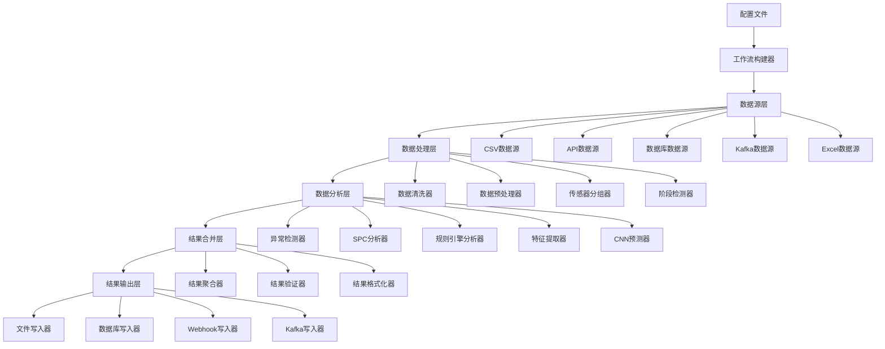
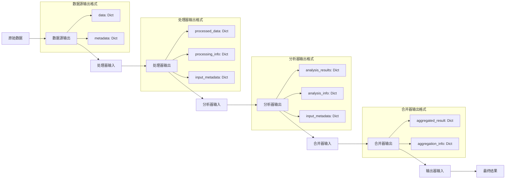
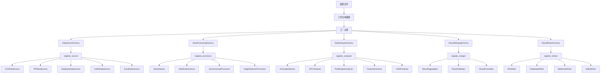
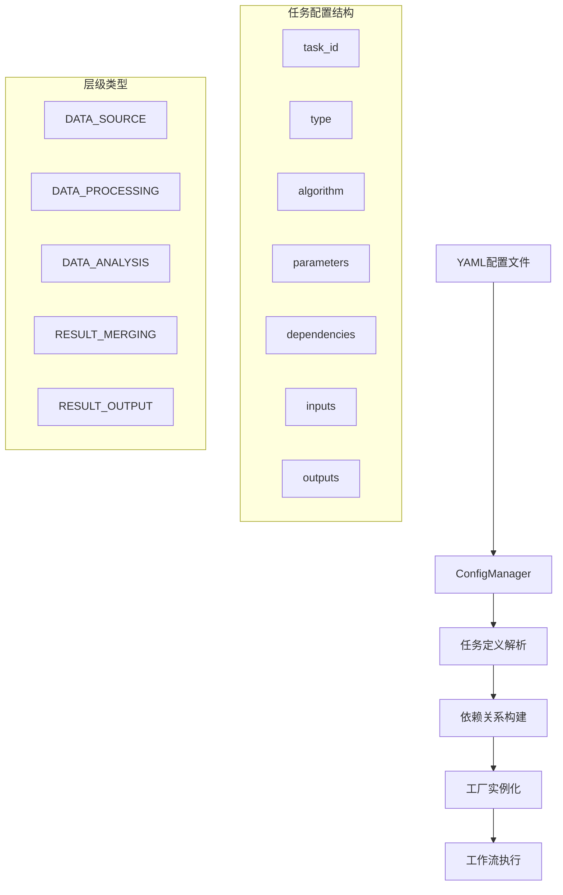
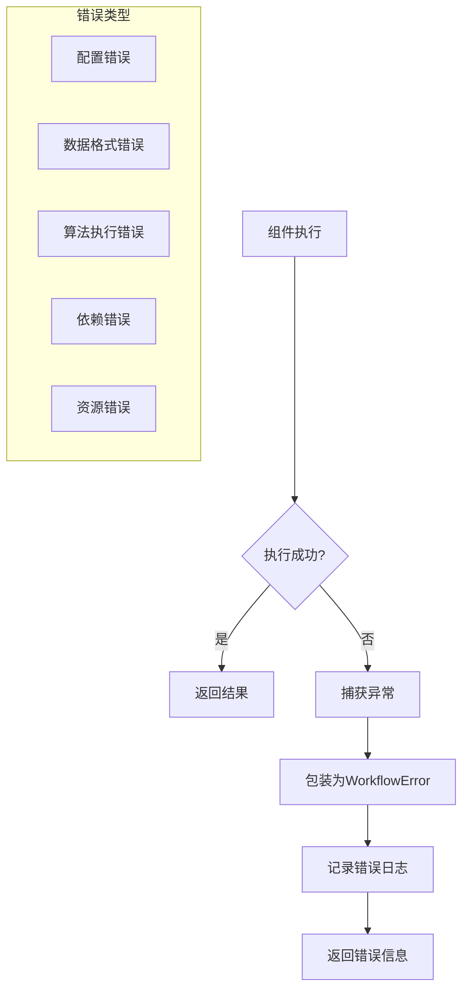

# 系统接口架构图

## 1. 整体架构流程

## 2. 接口继承关系

```mermaid
classDiagram
    class BaseDataSource {
        <<abstract>>
        +read(**kwargs) Dict[str, Any]
        +validate() bool
    }
    
    class BaseDataProcessor {
        <<abstract>>
        +process(data: Dict[str, Any], **kwargs) Dict[str, Any]
        +get_algorithm() str
    }
    
    class BaseDataAnalyzer {
        <<abstract>>
        +analyze(data: Dict[str, Any], **kwargs) Dict[str, Any]
        +get_algorithm() str
    }
    
    class BaseResultMerger {
        <<abstract>>
        +merge(results: List[Dict[str, Any]], **kwargs) Dict[str, Any]
        +get_algorithm() str
    }
    
    class BaseResultBroker {
        <<abstract>>
        +broker(result: Dict[str, Any], **kwargs) str
        +get_broker_type() str
    }
    
    class LayeredTask {
        <<abstract>>
        +execute(inputs: Dict[str, Any], **kwargs) Any
        +get_layer_type() LayerType
        +get_dependencies() List[str]
    }
    
    class CSVDataSource {
        -path: str
        -format: str
        -timestamp_column: str
        +read(**kwargs) Dict[str, Any]
        +validate() bool
        +get_algorithm() str
    }
    
    class APIDataSource {
        -url: str
        -method: str
        -headers: Dict[str, str]
        +read(**kwargs) Dict[str, Any]
        +validate() bool
        +get_algorithm() str
    }
    
    class DataCleaner {
        -algorithm: str
        -method: str
        +process(data: Dict[str, Any], **kwargs) Dict[str, Any]
        +get_algorithm() str
    }
    
    class AnomalyDetector {
        -algorithm: str
        -contamination: float
        +analyze(data: Dict[str, Any], **kwargs) Dict[str, Any]
        +get_algorithm() str
    }
    
    class ResultAggregator {
        -algorithm: str
        -weights: Dict[str, float]
        +merge(results: List[Dict[str, Any]], **kwargs) Dict[str, Any]
        +get_algorithm() str
    }
    
    class DatabaseWriter {
        -algorithm: str
        -connection_string: str
        -table: str
        +broker(result: Dict[str, Any], **kwargs) str
        +get_broker_type() str
    }
    
    BaseDataSource <|-- CSVDataSource
    BaseDataSource <|-- APIDataSource
    BaseDataProcessor <|-- DataCleaner
    BaseDataAnalyzer <|-- AnomalyDetector
    BaseResultMerger <|-- ResultAggregator
    BaseResultBroker <|-- DatabaseWriter
```

## 3. 数据流格式

## 4. 工厂注册模式

## 5. 扩展点说明

### 5.1 数据源扩展点

- **接口**: `BaseDataSource`
- **必需方法**: `read()`, `validate()`
- **可选方法**: `get_algorithm()`
- **注册位置**: `DataSourceFactory.register_source()`

### 5.2 数据处理器扩展点

- **接口**: `BaseDataProcessor`
- **必需方法**: `process()`, `get_algorithm()`
- **注册位置**: `DataProcessingFactory.register_processor()`

### 5.3 数据分析器扩展点

- **接口**: `BaseDataAnalyzer`
- **必需方法**: `analyze()`, `get_algorithm()`
- **注册位置**: `DataAnalysisFactory.register_analyzer()`

### 5.4 结果合并器扩展点

- **接口**: `BaseResultMerger`
- **必需方法**: `merge()`, `get_algorithm()`
- **注册位置**: `ResultMergingFactory.register_merger()`

### 5.5 结果输出器扩展点

- **接口**: `BaseResultBroker`
- **必需方法**: `broker()`, `get_broker_type()`
- **注册位置**: `ResultBrokerFactory.register_broker()`

## 6. 配置驱动的工作流

## 7. 错误处理流程

这个架构图展示了系统的完整接口设计和扩展模式，帮助开发者理解如何添加新组件。
