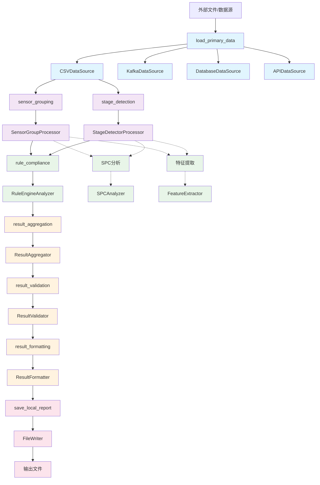

# 工作流类关系图

## 五层架构类关系图

```mermaid
classDiagram
    %% 基础接口层
    class BaseDataSource {
        <<interface>>
        +read() Dict[str, Any]
        +validate() bool
    }
    
    class BaseDataProcessor {
        <<interface>>
        +process(data) Dict[str, Any]
        +get_algorithm() str
    }
    
    class BaseDataAnalyzer {
        <<interface>>
        +analyze(data) Dict[str, Any]
        +get_algorithm() str
    }
    
    class BaseResultMerger {
        <<interface>>
        +merge(results) Dict[str, Any]
        +get_algorithm() str
    }
    
    class BaseResultBroker {
        <<interface>>
        +broker(result) str
        +get_broker_type() str
    }

    %% 数据源层 (Layer 1)
    class CSVDataSource {
        -path: str
        -format: str
        -timestamp_column: str
        +read() Dict[str, Any]
        +validate() bool
    }
    
    class KafkaDataSource {
        +read() Dict[str, Any]
        +validate() bool
    }
    
    class DatabaseDataSource {
        +read() Dict[str, Any]
        +validate() bool
    }
    
    class APIDataSource {
        +read() Dict[str, Any]
        +validate() bool
    }

    %% 数据处理层 (Layer 2)
    class SensorGroupProcessor {
        -algorithm: str
        -calculation_config: str
        +process(data) Dict[str, Any]
        +_perform_grouping() Dict[str, Any]
    }
    
    class StageDetectorProcessor {
        -algorithm: str
        -stage_config: str
        +process(data) Dict[str, Any]
        +_detect_stages() Dict[str, Any]
    }
    
    class DataPreprocessor {
        -algorithm: str
        -method: str
        -threshold: float
        +process(data) Dict[str, Any]
    }
    
    class DataCleaner {
        -algorithm: str
        -method: str
        +process(data) Dict[str, Any]
        +_clean_data() Dict[str, Any]
    }

    %% 数据分析层 (Layer 3)
    class RuleEngineAnalyzer {
        -algorithm: str
        -rule_config: str
        -spec_config: str
        +analyze(data) Dict[str, Any]
        +_check_rules() Dict[str, Any]
    }
    
    class SPCAnalyzer {
        -algorithm: str
        -chart_type: str
        -control_limits: str
        +analyze(data) Dict[str, Any]
    }
    
    class FeatureExtractor {
        -algorithm: str
        -features: List[str]
        +analyze(data) Dict[str, Any]
    }
    
    class CNNPredictor {
        -algorithm: str
        -model_path: str
        -input_shape: list
        +analyze(data) Dict[str, Any]
    }
    
    class AnomalyDetector {
        -algorithm: str
        +analyze(data) Dict[str, Any]
    }

    %% 结果合并层 (Layer 4)
    class ResultAggregator {
        -algorithm: str
        -weights: Dict[str, float]
        +merge(results) Dict[str, Any]
        +_weighted_average_merge() Dict[str, Any]
        +_majority_vote_merge() Dict[str, Any]
    }
    
    class ResultValidator {
        -algorithm: str
        -validation_rules: str
        +merge(results) Dict[str, Any]
        +_consistency_check() Dict[str, Any]
        +_range_validation() Dict[str, Any]
    }
    
    class ResultFormatter {
        -algorithm: str
        -output_format: str
        -include_metadata: bool
        +merge(results) Dict[str, Any]
        +_standard_format() Dict[str, Any]
        +_summary_format() Dict[str, Any]
    }

    %% 结果输出层 (Layer 5)
    class FileWriter {
        -algorithm: str
        -path: str
        -format: str
        +broker(result) str
        +_write_json() void
        +_write_yaml() void
    }
    
    class WebhookWriter {
        +broker(result) str
    }
    
    class KafkaWriter {
        +broker(result) str
    }
    
    class DatabaseWriter {
        +broker(result) str
    }

    %% 工作流管理
    class WorkflowBuilder {
        -config_manager: ConfigManager
        -rules_index: Dict[str, Any]
        +build(workflow_config) Callable
        +_execute_data_source_task() Any
        +_execute_data_processing_task() Any
        +_execute_data_analysis_task() Any
        +_execute_result_merging_task() Any
        +_execute_result_output_task() Any
    }
    
    class WorkflowExecutor {
        -config: Dict[str, Any]
        +execute(flow_func) Any
        +execute_async(flow_func) Any
        +execute_with_monitoring() Dict[str, Any]
    }

    %% 工厂类
    class DataSourceFactory {
        <<factory>>
        +create_source(config) BaseDataSource
        +register_source(type, class)
    }
    
    class DataProcessingFactory {
        <<factory>>
        +create_processor(config) BaseDataProcessor
        +register_processor(type, class)
    }
    
    class DataAnalysisFactory {
        <<factory>>
        +create_analyzer(config) BaseDataAnalyzer
        +register_analyzer(type, class)
    }
    
    class ResultMergingFactory {
        <<factory>>
        +create_merger(config) BaseResultMerger
        +register_merger(type, class)
    }
    
    class ResultBrokerFactory {
        <<factory>>
        +create_broker(config) BaseResultBroker
        +register_broker(type, class)
    }

    %% 继承关系
    BaseDataSource <|-- CSVDataSource
    BaseDataSource <|-- KafkaDataSource
    BaseDataSource <|-- DatabaseDataSource
    BaseDataSource <|-- APIDataSource
    
    BaseDataProcessor <|-- SensorGroupProcessor
    BaseDataProcessor <|-- StageDetectorProcessor
    BaseDataProcessor <|-- DataPreprocessor
    BaseDataProcessor <|-- DataCleaner
    
    BaseDataAnalyzer <|-- RuleEngineAnalyzer
    BaseDataAnalyzer <|-- SPCAnalyzer
    BaseDataAnalyzer <|-- FeatureExtractor
    BaseDataAnalyzer <|-- CNNPredictor
    BaseDataAnalyzer <|-- AnomalyDetector
    
    BaseResultMerger <|-- ResultAggregator
    BaseResultMerger <|-- ResultValidator
    BaseResultMerger <|-- ResultFormatter
    
    BaseResultBroker <|-- FileWriter
    BaseResultBroker <|-- WebhookWriter
    BaseResultBroker <|-- KafkaWriter
    BaseResultBroker <|-- DatabaseWriter

    %% 工厂关系
    DataSourceFactory ..> BaseDataSource : creates
    DataProcessingFactory ..> BaseDataProcessor : creates
    DataAnalysisFactory ..> BaseDataAnalyzer : creates
    ResultMergingFactory ..> BaseResultMerger : creates
    ResultBrokerFactory ..> BaseResultBroker : creates

    %% 工作流关系
    WorkflowBuilder ..> DataSourceFactory : uses
    WorkflowBuilder ..> DataProcessingFactory : uses
    WorkflowBuilder ..> DataAnalysisFactory : uses
    WorkflowBuilder ..> ResultMergingFactory : uses
    WorkflowBuilder ..> ResultBrokerFactory : uses
    WorkflowExecutor ..> WorkflowBuilder : executes
```

## 数据流图

## 任务输入输出总结表

| 层级 | 任务ID | 输入 | 输出 |
|------|--------|------|------|
| **数据源层** | load_primary_data | 外部文件路径 | `{data: 传感器数据, metadata: 元数据}` |
| **数据处理层** | sensor_grouping | 原始传感器数据 | `{grouping_info: 分组信息, algorithm: 算法名}` |
| | stage_detection | 原始数据+分组信息 | `{stage_info: 阶段信息, algorithm: 算法名}` |
| **数据分析层** | rule_compliance | 阶段信息+分组信息 | `{rule_results: 规则结果, analysis_info: 分析信息}` |
| | (可扩展) | 相同输入 | 各种分析结果 |
| **结果合并层** | result_aggregation | 分析结果 | `{aggregated_result: 聚合结果, aggregation_info: 聚合信息}` |
| | result_validation | 聚合结果 | `{validation_result: 验证结果, validation_info: 验证信息}` |
| | result_formatting | 验证结果 | `{formatted_result: 格式化结果, format_info: 格式信息}` |
| **结果输出层** | save_local_report | 格式化结果 | 文件路径字符串 |

## 并行执行说明

- **当前实现**: 串行执行，通过拓扑排序确定顺序
- **架构支持**: data_analysis层支持多个并行task，共享相同输入
- **扩展性**: 可以轻松添加更多分析器，它们可以并行处理相同的数据
